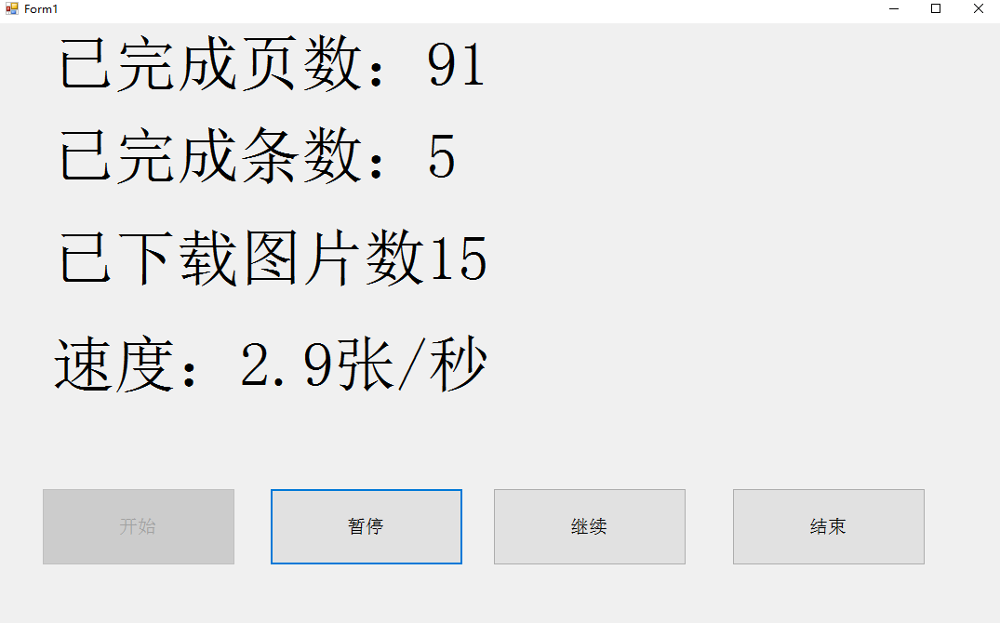

# WebCrawler
## Example(示例)

UI made in C# WinForm.
这个UI是用C#WinForm简单制作的。

NO Mosaic（没有马赛克）（这不会被封号吧- -！）
## Webcrawler(网络爬虫)

主要是爬网站，盗取一些图片什么的，第一个爬虫代码，纪念下 ^_^.

Just a demo.

只是一个demo。

Main Code: C#regular expression.

主要代码是：C#的正则表达式。
